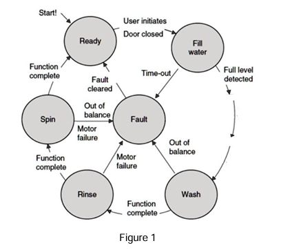
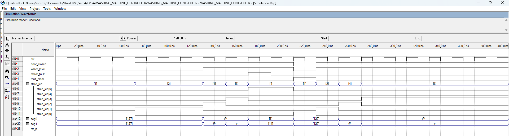

# fpga-washing-machine-fsm

## 📌 Overview

This project implements an FPGA-based automatic washing machine controller using a Finite State Machine (FSM) in Verilog HDL. The system controls the full washing cycle including filling, washing, rinsing, spinning, and fault handling.

## 🧠 How it works
The system transitions through:
READY → FILL → WASH → RINSE → SPIN → READY

Fault condition:
→ Goes to FAULT state and stops system

## ⚙️ System Architecture

The controller is designed using FSM with the following states:

* READY
* FILL
* WASH (10s)
* RINSE (10s)
* SPIN (5s)
* FAULT

State transitions are controlled using counters and input signals such as door status, water level, and motor fault.

## 🛠️ Technologies Used

* Verilog HDL
* Quartus II 9.1
* Altera DE2 FPGA Board

## 🧪 Features

* Time-controlled washing cycles using counters
* Fault detection and recovery mechanism
* Real-time FSM-based control system
* 7-segment display output for system status

## 📊 Simulation Results

The system was verified using waveform simulation to validate:

* Correct state transitions
* Timing accuracy
* Fault handling behavior

## 🧠 FSM Diagram

## 📊 Simulation

## ⚙️ Inputs
- clk
- reset
- door_closed
- water_level
- motor_fault

## ⚙️ Outputs
- LED
- 7-segment display

## 🚀 Implementation

* Designed and simulated in Quartus II
* Successfully deployed on DE2 FPGA board
* Verified real-time operation

## 📌 Key Learning Outcomes

* FSM design and implementation
* Verilog HDL coding and debugging
* FPGA-based system deployment
* Digital system timing control

## 🔧 Future Improvements

* Add sensor-based automation (water level, load detection)
* Integrate LCD or user interface
* Optimize power consumption
